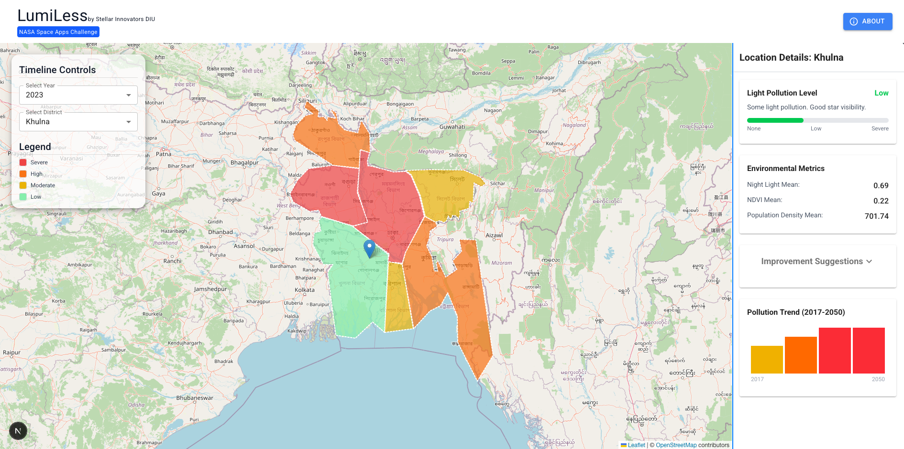

# LumiLess - Air Quality Visualization App <br> <sub>by Stellar Innovators</sub>



## Project Overview

LumiLess is an innovative web application designed to visualize air quality data across different regions of Bangladesh. Built with Next.js and Tailwind CSS, the app provides users with an interactive map and detailed pollution metrics, helping them understand and monitor air quality trends over time.


## Getting Started

First, install the dependencies:

```bash
npm install
# or
yarn install
# or
pnpm install
# or
bun install
```

Next, run the development server:

```bash
npm run dev
# or
yarn dev
# or
pnpm dev
# or
bun dev
```

Open [http://localhost:3000](http://localhost:3000) with your browser to see the result.
